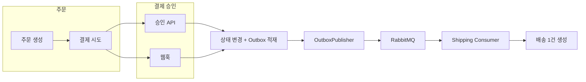
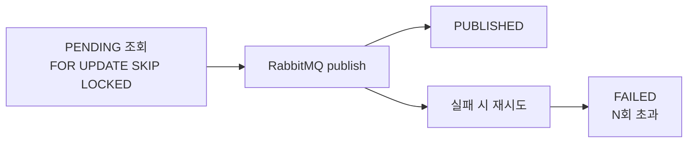

# 주문 → 결제 → 배송 흐름

주문 생성부터 배송 생성까지의 단계와, 각 단계에서 보장하는 성질을 정리한다.

---

## 전체 흐름도

**결제 승인**은 두 경로 중 하나로 들어온다.

- **승인 API**: 클라이언트/내부 → `POST /payments/{id}/authorize` + `Idempotency-Key`
- **웹훅**: PG → `POST /payments/webhooks/mock` (providerEventId 멱등)

둘 다 성공 시 **상태 변경**과 **Outbox 적재**를 한 트랜잭션에서 수행한 뒤, Publisher가 RabbitMQ로 발행하고 Consumer가 배송을 생성한다.

---

## 전제 (가정·규칙)

| 항목 | 내용 |
|------|------|
| 재고 | 주문 시 `available` 감소 없이 `reserved`만 증가. 승인 시 확정 차감, 실패 시 예약 해제만. |
| 입력 정규화 | 동일 productId는 합산, productId 오름차순 정렬로 락 순서 고정. |
| 재고 락 | `SELECT ... FOR UPDATE`로 한 트랜잭션 내에서만 예약/확정 처리. |
| 웹훅 | 중복 수신 가능 → `providerEventId` 유니크로 멱등. |
| 승인·Outbox | 결제 승인과 Outbox 적재는 같은 트랜잭션. |
| 이벤트 | at-least-once 가정. 배송은 `order_id` 유니크로 중복 생성 방지. |

---

## 단계별 요약

### 1. 주문 생성 (CreateOrderUseCase)

| 구분 | 내용 |
|------|------|
| 동작 | 재고 행 `FOR UPDATE` → 가용량 검증(`available - reserved`) → `reserved` 증가. |
| 보장 | 동시 주문 시에도 초과 예약 방지. productId 오름차순 락으로 데드락 가능성 완화 유지. |

---

### 2. 결제 시도 생성 (CreatePaymentUseCase)

| 구분 | 내용 |
|------|------|
| 동작 | 주문 상태를 `PAYMENT_PENDING`으로 변경. |
| 보장 | 주문이 CREATED일 때만 결제 생성. 잘못된 상태 전이 차단. |

---

### 3. 결제 승인 요청 (AuthorizePaymentUseCase)

| 구분 | 내용 |
|------|------|
| 동작 | `Idempotency-Key` 필수. `(paymentId, idempotencyKey)`로 기존 레코드 조회. 존재 시 request_hash 비교 → 동일 요청이면 기존 응답 반환, 다르면 409. 없으면 AUTHORIZED(재고 확정·Outbox) 또는 FAILED(예약 해제) 적용 후 레코드 저장. |
| 보장 | 재시도 환경에서 중복 처리 방지 및 동일 응답 유지. |

---

### 4. 결제 웹훅 수신 (ProcessPaymentWebhookUseCase)

| 구분 | 내용 |
|------|------|
| 동작 | `(provider, providerEventId)` 유니크 기반 insert-first 전략. 먼저 insert를 시도하고, UNIQUE 위반 시 이미 처리된 이벤트로 간주하고 현재 상태 반환. AUTHORIZED → 재고 확정·Outbox 적재, FAILED → 예약 해제만. |
| 보장 | 동일 웹훅 중복 수신 시 상태 중복 반영 방지. |

---

### 5. Outbox 적재

| 구분 | 내용 |
|------|------|
| 동작 | 결제 승인(API 또는 웹훅) 시 `PAYMENT_AUTHORIZED` 이벤트를 outbox_events에 PENDING으로 insert. **상태 변경과 같은 트랜잭션.** |
| 보장 | “상태는 바뀌었는데 이벤트는 없음” 상황 방지. |

---

### 6. Outbox 발행 (OutboxPublisher → RabbitMQ)

| 구분 | 내용 |
|------|------|
| 동작 | PENDING 이벤트 배치 조회(`FOR UPDATE SKIP LOCKED`) → RabbitMQ publish → 성공 시 PUBLISHED. 실패 시 재시도, N회 초과 시 FAILED 상태로 유지. 반복 실패 메시지는 DLQ로 분리. |
| 보장 | 다중 인스턴스 환경에서 동일 이벤트 동시 처리 방지. at-least-once 발행 모델 유지. |

---

### 7. 배송 생성 (Shipping Consumer)

| 구분 | 내용 |
|------|------|
| 동작 | `shipping.payment-authorized` 큐 구독 → payload에서 orderId 추출 → CreateShipmentUseCase. `order_id` UNIQUE + “있으면 반환, 없으면 insert”, UNIQUE 위반 시 재조회. |
| 보장 | at-least-once로 같은 메시지가 다시 와도 1주문 1배송 유지. |

---

## 요약 표

| 영역 | 정리 |
|------|------|
| 재고 | 주문 시 예약 ↑, 승인 시 확정 차감, 실패 시 예약 해제만. |
| 결제 | 승인 API(Idempotency-Key), 웹훅(providerEventId) 각각 멱등. |
| 이벤트 | Outbox로 상태 변경과 기록 원자화, RabbitMQ 발행·재시도·DLQ. |
| 배송 | order_id 유니크 + 멱등 처리로 1주문 1배송. |
